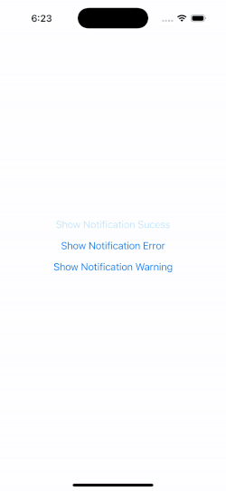

<h1 align="center">
React Native Push Down Alert
</h1>

<p align="center">
  <a href="https://www.npmjs.com/package/react-native-pushdown-alert">
    
  </a>
  <a title='License' href="https://github.com/benjamineruvieru/react-native-pushdown-alert/blob/master/LICENSE" height="18">
    
  </a>
  <a title='Tweet' href="https://twitter.com/intent/tweet?text=Check%20out%20this%20awesome%20React%20Native%20Push%20Down%20Alert%20Library&url=https://github.com/benjamineruvieru/-pushdown-alert&via=benjamin_eru&hashtags=react,reactnative,opensource,github,ux" height="18">
    
  </a>
</p>

A customizable pushdown alert component for React Native applications. It provides a simple way to display success, error, and warning notifications with a unique pushdown animation that pushes down the entire content of app to show the notification.



## Features

- Display success, error, and warning notifications.
- Customizable alert appearance and behavior.
- Queue or cancel current alerts based on configuration.
- Supports custom icons and styles.

## Installation

To install the library, use npm or yarn:

```bash
npm install react-native-pushdown-alert
# or
yarn add react-native-pushdown-alert
```

## Usage

Here's a basic example of how to use the react-native-pushdown-alert in your application:

```typescript

import { PushDownAlertPortal, showNotification} from 'react-native-pushdown-alert';
import { View, Button } from 'react-native';

const MyApp = () => {
  return (
    <View>
      <Button
        title="Show Notification Success"
        onPress={() => {
          showNotification({
            type: 'success',
            message: 'Hi a message body',
            title: 'Hello World',
          });
        }}
      />
    </View>
  );
};

const config = {}

const App = () => {
  return (
    <PushDownAlertPortal config={config}>
      <MyApp />
    </PushDownAlertPortal>
  );
};


```

## API

### showNotification

- Parameters :
  - type : Type of the alert ( 'success' , 'error' , 'warning' ).
  - title : Title of the alert.
  - message : Message body of the alert.

### PushDownAlertPortal

- Props :
  - config : Configuration object for customizing alert behavior and appearance.

## Configuration

You can customize the alert behavior and appearance by passing a configuration object to the PushDownAlertPortal component. Here are some of the available options:

- alertDisplayDuration : Duration for which the alert is displayed.
- openAnimationDuration : Duration of the open animation.
- closeAnimationDuration : Duration of the close animation.
- alertQueueBehaviour : Determines whether to queue alerts or cancel the current one ( 'queue' or 'cancelCurrent' ).
- titleTextStyle : Custom style for the alert title.
- messageTextStyle : Custom style for the alert message.
- successConfig , errorConfig , warningConfig : Custom configurations for each alert type, including icons and background colors.

### Sample Configuration

Here's an example of how you can customize the alert configurations:

```typescript
const config = {
  alertDisplayDuration: 4000,
  openAnimationDuration: 500,
  closeAnimationDuration: 500,
  alertQueueBehaviour: 'queue',
  titleTextStyle: { fontSize: 18, fontWeight: 'bold', color: '#fff' },
  messageTextStyle: { fontSize: 16, color: '#fff' },
  successConfig: {
    icon: <CustomSuccessIcon />, // Replace with your custom icon component
    backgroundColor: '#4CAF50', // Green background for success alerts
  },
  errorConfig: {
    icon: <CustomErrorIcon />, // Replace with your custom icon component
    backgroundColor: '#F44336', // Red background for error alerts
  },
  warningConfig: {
    icon: <CustomWarningIcon />, // Replace with your custom icon component
    backgroundColor: '#FFC107', // Yellow background for warning alerts
  },
};
```

## Contributing

See the [contributing guide](CONTRIBUTING.md) to learn how to contribute to the repository and the development workflow.

## License

MIT

```

```
